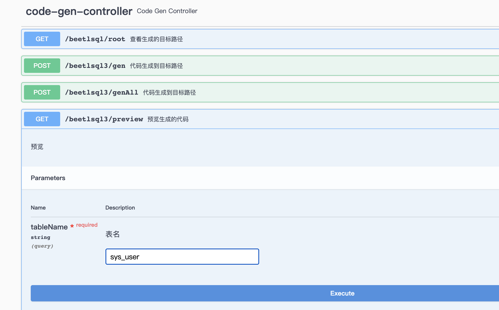

BeetlSQL3 内置了一个 Rest 接口`org.beetl.sql.starter.CodeGenController`，用户可以导入此 Controller 来为自己系统提供代码生成 API

目前能根据表名生成 Entity,Mapper,SQL 文件，以及数据库的 markdown 格式文档，[参考示例](https://gitee.com/xiandafu/beetlsql/tree/master/sql-integration/sql-springboot-starter/src/test/java/org/beetl/sql/springboot/swagger)

需要配置 bean
```java
@Configuration
public class CodeGen {

    @Bean
    public CodeGenController codeGenController() {
        return new CodeGenController();
    }
}
```

::: warning
注意，如果系统包含了多个 SQLManager，则不能使用 CodeGenController
:::

---

```java
List<SourceBuilder> sourceBuilder = new ArrayList<>();
SourceBuilder entityBuilder = new EntitySourceBuilder();
SourceBuilder mapperBuilder = new MapperSourceBuilder();
SourceBuilder mdBuilder = new MDSourceBuilder();

sourceBuilder.add(entityBuilder);
sourceBuilder.add(mapperBuilder);
sourceBuilder.add(mdBuilder);

SourceConfig config = new SourceConfig(sqlManager,sourceBuilder);
//如果有错误，抛出异常而不是继续运行 1
EntitySourceBuilder.getGroupTemplate().setErrorHandler(new ReThrowConsoleErrorHandler() );

ConsoleOnlyProject project = new ConsoleOnlyProject();
String tableName = "sys_user";
//可以在控制台看到生成的所有代码
config.gen(tableName,project);
```

SourceConfig 是核心类，类通过 SQLManager 构造，另外一个参数是 SourceBuilder 列表。

SourceBuilder 代表了代码生成逻辑，比如生成 POJO 代码，生成 Mapper 代码，生成 Service 代码，生成数据库文档

BeetlSQL 内置了如下生成

- EntitySourceBuilder 生成 POJO 代码
- MapperSourceBuilder 生成 Mapper 代码
- MDSourceBuilder 生成 markdown 文件
- MDDocBuilder，生成一个数据库表文档，markdown 格式

你可以实现 SourceBuilder，以生成特定的代码或者文档，或者其他类型文档。

配置好 SourceConfig 后，需要使用一个 BaseProject 的子类，告诉生成代码存放在哪里，BeetlSQL3 提供如下 Project
- ConsoleOnlyProject 仅仅输出到控制台，你可以把生成的代码复制到你需要的类里
- SimpleMavenProject 当前工程是 maven 工程，输出成文件到 maven 工程里，不推荐，这样很容易覆盖以前生成好但有微调过的代码，除非你是第一次使用
- StringOnlyProject 输出到字符串里：
```java
StringOnlyProject project = new StringOnlyProject();
String tableName = "sys_user";
config.gen(tableName,project);
String content = project.getContent();
```
SourceConfig 类有很多配置选项，比如，使用 BigDecimal 还是 Double，每个 SourceBuilder 实现也可以设置不同属性。比如，配置生成的 java 类的包名。

详细使用查看 [示例代码 S7CodeGen](//TODO)
