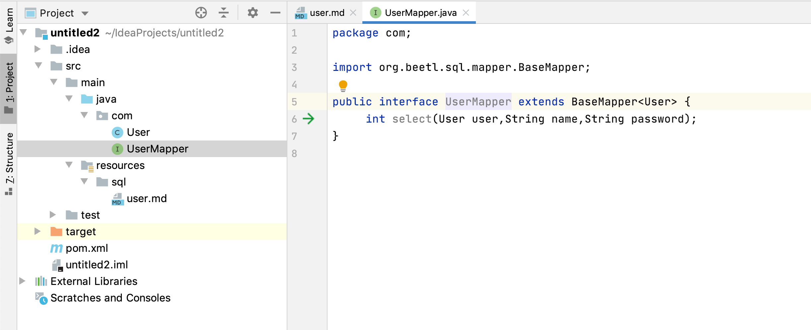
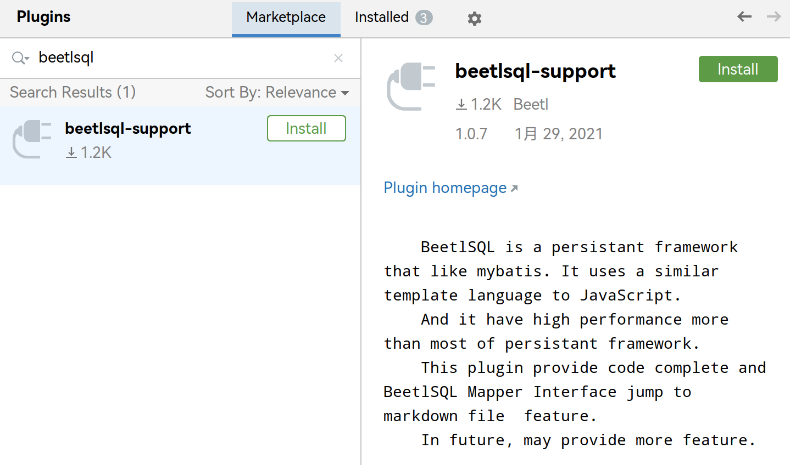
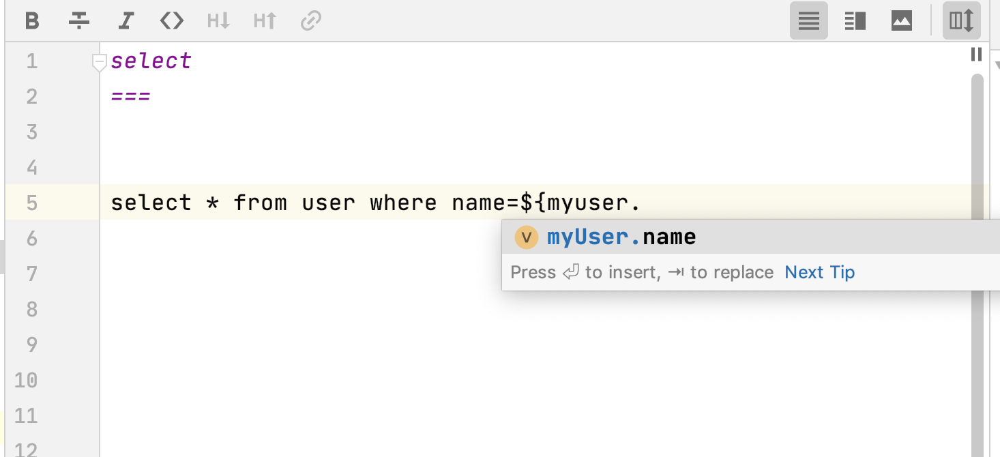
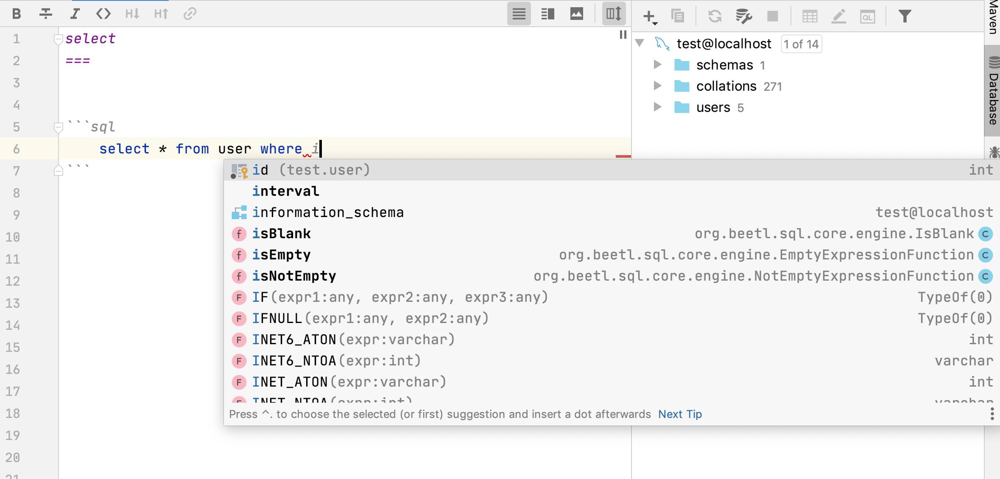

BeetlSQL3 提供了一个跳转和补全插件，能从 Mapper 自动跳转到对应的 Markdown 文件，如下绿色箭头所示



## 安装
进入 IDEA 插件市场，搜索 BeetlSql 即可



插件源码：[https://gitee.com/eighttrigrams/beetlsql-idea-support](https://gitee.com/eighttrigrams/beetlsql-idea-support)

## 语法提示
有如下 Mapper
```java
public interface UserMapper extends BaseMapper<User> {
    int select(User user,String password);
}
```
在对应 md 文档中，键入 u，则自动能提示与此相关单词



#### 如果你是 Idea 企业版可以利用 Idea 企业对 markdown 的 sql 片段支持

企业版能自动识别并提示你配置一个数据源，这样可以在 sql 片段里更好的编写 sql 语句，即提供 SQL 语法，也提供 beetlsql 语法
````md
select
===
​```sql
select * from user where id=    
​```
````
