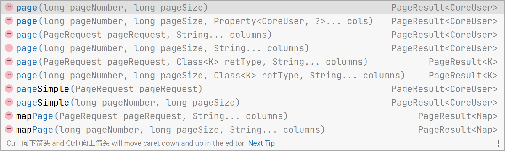

分页查询是我们经常要使用的功能，beetlSql 支持多数据，会自动适配当前数据库生成分页语句

### 方式一：使用`LambdaQuery.limit()`分页查询
继续以 User 为例子

##### mapper
```java
public interface UserMapper extends BaseMapper<User> {

}
```
##### 调用
```java{13}
@Autowired
UserMapper userMapper;

/**
* 查询用户
*/
@RequestMapping("page")
public String page() {
    PageResult<User> result = userMapper.createLambdaQuery()
    .andLike(User::getName,"%t%")
    .andIsNotNull(User::getDeleteTime)
    .desc(User::getId)
    .limit(1, 10);
}
```
---

### 方式二：使用`LambdaQuery.page()`分页查询

```java{13}
@Autowired
UserMapper userMapper;

/**
* 查询用户
*/
@RequestMapping("page")
public String page() {
    PageResult<User> result = userMapper.createLambdaQuery()
    .andLike(User::getName,"%t%")
    .andIsNotNull(User::getDeleteTime)
    .desc(User::getId)
    .page(1, 10);
}
```
`page()`中传入起始页和查询条数即可

返回值`PageResult<T>`包含了查询到的列表数据和总条数
```java
List<User> list = result.getList();
long totalRow = result.getTotalRow();
```

更常用的是传入一个`PageRequest`对象，通过`PageRequest`对象可以构造更多选项

比如
- totalRequired 是否需要查询总条数
- orderBy 排序方式
```java
PageResult<User> result = userDao.createLambdaQuery()
    .page(DefaultPageRequest.of(1,10));
```
page 方法还有很多重载方法，具体使用参见代码



---

### 方式三：使用 @Sql 或 @Template 注解
使用`page()`函数指明分页查询，`PageRequest`是分页参数
```java{3}
public interface UserMapper extends BaseMapper<User> {
    
    @Template("select #{page()} from sys_user where department_id = #{id}")
    PageResult<User> pageQueryById(Integer id,PageRequest pageRequest);
}
```

### 方式四：在 markdown 文件中使用`pageTag()`

##### mapper
```java
public interface UserMapper extends BaseMapper<User> {

    PageResult<User> pageTest(PageRequest query);
}
```
##### user.md
````md{5,7}
pageTest
===
```sql
select
-- @{pageTag()
    name, age
-- @}
from user
```

````
