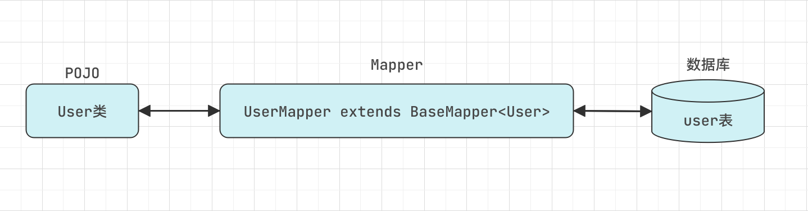

`BaseMapper`接口内置了大量增删查改方法，详细见 [BaseMapper.java](https://gitee.com/xiandafu/beetlsql/blob/master/sql-mapper/src/main/java/org/beetl/sql/mapper/BaseMapper.java)

#### 使用方法
如同[快速开始](/start/quick)中所见，使用 BaseMapper 接口内置方法，只需新建 Mapper 接口继承`BaseMapper`并指定类型，
指定类型为数据库表所对应的 POJO，以 user 表为例
```java
public interface UserMapper extends BaseMapper<User> {

}
```
这样 UserMapper 就拥有了下面一种关系，从而可以通过操作 User 类来来完成对 user 表的操作



---
BaseMapper 具备很多内置的 CRUD 方法，因此有了 UserMapper 后，同样可以不写任何 SQL，可以轻易的完成常用操作
我们可以将`UserMapper`注入，然后调用它的方法完成 CRUD

下面列举几个常用方法：

| 方法 | 说明 |
| :--- | :--- |
| `void insert(T entity)` | 通用插入，插入一个实体对象到数据库 |
| `void insertTemplate(T entity)` | 插入实体到数据库，对于 null 值不做处理 |
| `int updateById(T entity)` | 据主键更新对象，所以属性都参与更新 |
| `boolean upsert(T entity)` | 按照主键更新更新或插入，自增或者序列 id 自动赋值给 entity |
| `int deleteById(Object key)` | 根据主键删除对象，如果对象是复合主键，传入对象本生即可 |
| `T single(Object key)` | 根据主键获取对象，如果对象不存在，返回 null |
|  还有更多... | 更多 BaseMapper 内置方法使用参见 [ BaseMapper.java ](https://gitee.com/xiandafu/beetlsql/blob/master/sql-mapper/src/main/java/org/beetl/sql/mapper/BaseMapper.java) |
