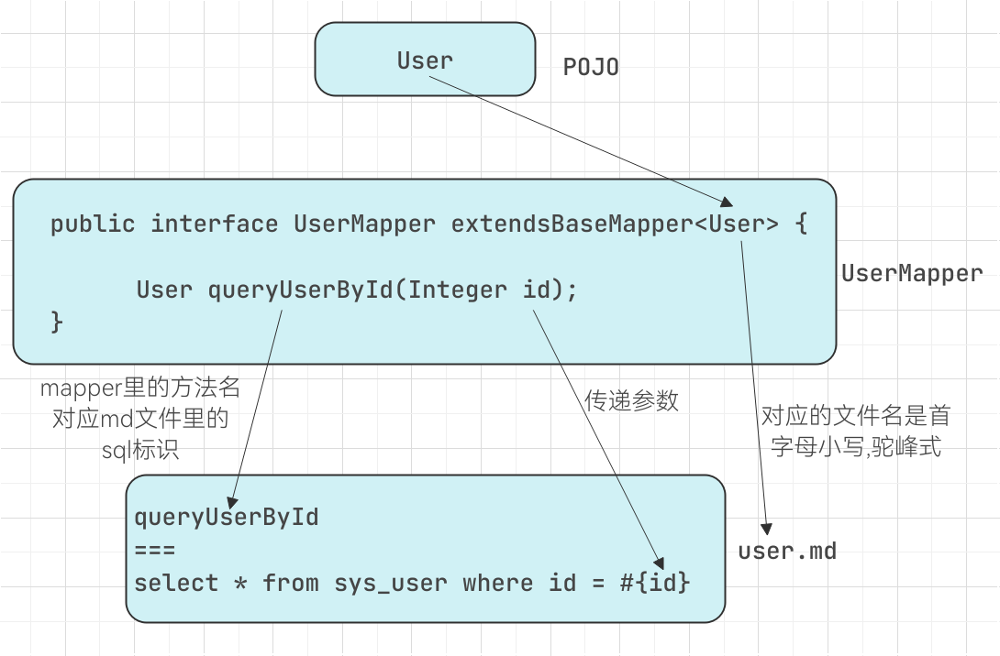

使用 Markdown 文件组织 sql 方式和注解相同的地方都是在 Mapper 里定义方法，方法上**不加**`@Sql`或`@Template`即可
所有 Markwown 的 sql 文件默认位于 classpath 的 sql 目录下。一个 sql 文件里可以写多个 sql 片段
:::tip 使用 Markdown 的优点
- XML 格式过于复杂，书写不方便
- XML 格式有保留符号，写 SQL 的时候不方便，如常用的< 符号 必须转义
- md 格式本身就是一个文档格式，容易通过浏览器和各种开发工具阅读和编辑维护
- md 中的 sql 语句是一个整体，可以直接复制出来执行，XML 无法做到
:::

---
#### 使用方法
我们继续以 User 为例

在 UserMapper 中定义`queryUserById`方法
```java
public interface UserMapper extends BaseMapper<User> {

    // 定义方法，不加 @Sql 或 @Template 注解，BeetlSQL 就会去 markdown 文件查找 sql
    User queryUserById(Integer id);
}
```

在`resources/sql/`文件夹下新建 user.md 写 sql

使用`===`作为分隔，`===`上方是 sql 片段名称 (要与 mapper 中的方法名相同),`===`下方是 sql 语句，切记名称后不要有空格或者任何不可见的符号，否则 BeetlSQL 找不到
##### 结构示例
```markdown
SQL 名称
===
以 * 开头的注释
SQL 语句

SQL 名称 2
===
SQL 语句 2
```

````markdown
queryUserById
===
```sql
select * from sys_user where id = #{id}
```
````
markdown 中使用` ```sql `是可选的，好处在于帮助 IDE 或者其他工具能对 sql 进行 ==高亮== 和**语法校验**

---
POJO,mapper 接口，markdown 之间的关系如下图所示



:::tip  
:tada: 到此处您已经了解了 BeetlSQL 操作数据库的几种方式：
- BaseMapper 内置方法
- LambdaQuery
- @Sql 注解提供 sql 语句
- @SqlTemplate 提供 sql 语句
- @SpringData 注解根据方法名生成 sql
- 使用 markwown 语法在 md 文件中写 sql

接下来我们分别介绍每一种方式更丰富的高级用法和适用场景
:::
